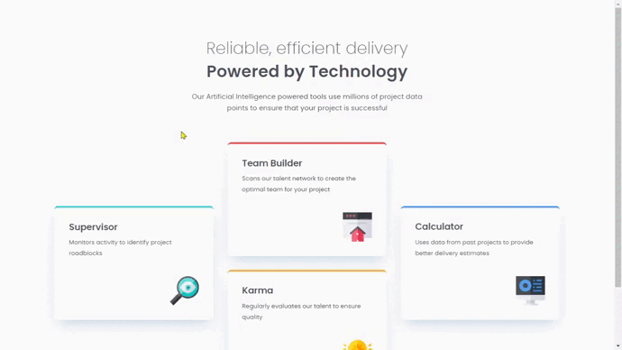

# Frontend Mentor - Four card feature section solution

This is a solution to the [Four card feature section challenge on Frontend Mentor](https://www.frontendmentor.io/challenges/four-card-feature-section-weK1eFYK).

Frontend Mentor challenges help you improve your coding skills by building realistic projects. 

🔳 [The challenge](#the-challenge-nerd_face)

🔳 [Screenshots](#screenshots-camera)

🔳 [Links](#links-link)

🔳 [Built with](#built-with-hammer_and_pick)

🔳 [Author](#author-beginner)

## *The challenge* :nerd_face:

Users should be able to:

🎯 View the optimal layout for the site depending on their device's screen size.

## *Screenshots* :camera:

## *Links* :link:

[Live Site URL](https://mendezpvi.github.io/fm-four-card-feature/) 👀

[Challenges overcome](https://github.com/mendezpvi/frontend-mentor-challenges) 👀

## *Built with* :hammer_and_pick:

✅ Semantic HTML5 markup

✅ CSS custom properties

✅ Utility classes

✅ Flexbox

✅ CSS Grid

✅ Mobile-first workflow

## *Author* :beginner:

✨ Frontend Mentor - [@mendezpvi](https://www.frontendmentor.io/profile/mendezpvi)
